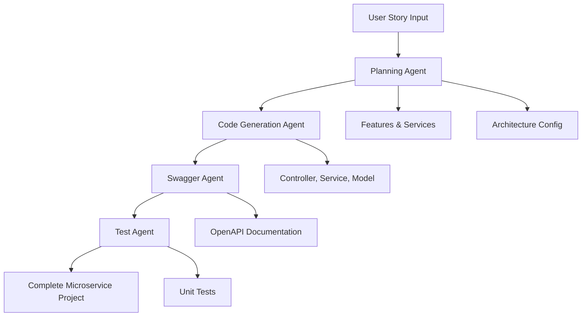

# CodeCrafter AI: GenAI-Powered Microservice Builder

[](https://python.org)
[](https://streamlit.io)
[](https://langchain.com)
[](https://ai.google.dev)

CodeCrafter AI is an intelligent microservice code generator that transforms user stories into complete, production-ready microservice applications using a sophisticated multi-agent AI architecture powered by Google Gemini and LangGraph.

## 🚀 Features

### 🤖 Multi-Agent Architecture
- **Planning Agent**: Analyzes user stories and designs microservice architecture
- **Code Generation Agent**: Creates production-ready service code
- **Swagger Agent**: Generates comprehensive API documentation
- **Test Agent**: Creates unit tests for all generated services

### 🌐 Multi-Language Support
- **Java** - Spring Boot microservices
- **NodeJS** - Express.js applications
- **.NET** - ASP.NET Core services
- **Python** - FastAPI/Flask applications
- **Go** - Gin/Echo frameworks
- **Ruby** - Rails API applications
- **PHP** - Laravel/Symfony services
- **Kotlin** - Spring Boot with Kotlin

### 🏗️ Architecture Patterns
- **REST APIs** - Traditional RESTful services
- **gRPC** - High-performance RPC services
- **Event-Driven** - Asynchronous messaging patterns

### 🛠️ Infrastructure Support
- **Databases**: PostgreSQL, MongoDB, DynamoDB
- **Messaging**: Apache Kafka, AWS SQS
- **Caching**: Redis
- **API Gateway**: Spring Cloud Gateway, Express Gateway, Ocelot
- **Service Discovery**: Eureka, Consul

## 📋 Table of Contents

- [Installation](#installation)
- [Quick Start](#quick-start)
- [Architecture](#architecture)
- [Usage](#usage)
- [Configuration](#configuration)
- [Output Structure](#output-structure)
- [Examples](#examples)
- [Contributing](#contributing)
- [License](#license)

## 🔧 Installation

### Prerequisites
- Python 3.8 or higher
- Google Gemini API key ([Get one here](https://ai.google.dev))

### Setup

1. **Clone the repository**
   ```bash
   git clone https://github.com/Amruth22/CodeCraftProject-AgenticAI.git
   cd CodeCraftProject-AgenticAI
   ```

2. **Install dependencies**
   ```bash
   pip install -r installation.txt
   ```

3. **Configure environment variables**
   ```bash
   cp .env.example .env
   # Edit .env and add your Gemini API keys
   ```

4. **Run the application**
   ```bash
   streamlit run main.py
   ```

## ⚡ Quick Start

1. **Launch the application**
   ```bash
   streamlit run main.py
   ```

2. **Enter your user story**
   ```
   Users should be able to register, login, view products, add items to cart, and checkout with payment processing.
   ```

3. **Select your backend language**
   - Choose from Java, NodeJS, .NET, Python, Go, Ruby, PHP, or Kotlin

4. **Generate microservices**
   - Click "Generate Microservices" and watch the magic happen!

5. **Review generated code**
   - Explore the generated services, APIs, and tests
   - Download the complete project structure

## 🏛️ Architecture

### Multi-Agent Workflow



### State Management

The system uses a centralized state management approach with `CodeCrafterState`:

```python
class CodeCrafterState(TypedDict):
    # Input
    user_story: str
    language: str
    
    # Planning Results
    features: List[str]
    services: List[str]
    architecture_config: Dict[str, str]
    
    # Generated Outputs
    service_outputs: Dict[str, Dict[str, str]]
    swagger_outputs: Dict[str, Dict[str, str]]
    test_outputs: Dict[str, Dict[str, str]]
    
    # Status Tracking
    planning_complete: bool
    codegen_complete: bool
    swagger_complete: bool
    tests_complete: bool
```

## 📖 Usage

### Web Interface

1. **Access the Streamlit interface** at `http://localhost:8501`
2. **Enter your user story** describing the desired functionality
3. **Select the backend language** for code generation
4. **Click "Generate Microservices"** to start the process
5. **Review the results** including:
   - Extracted features and services
   - Architecture recommendations
   - Generated code preview
   - Swagger documentation
   - Unit tests

### Programmatic Usage

```python
from graph import run_all_agents

# Generate microservices programmatically
result = run_all_agents(
    user_story="Users should register and login",
    language="Python"
)

# Access generated code
services = result["code_output"]
swagger_docs = result["swagger_output"]
tests = result["test_output"]
```

## ⚙️ Configuration

### Environment Variables

Create a `.env` file with your Gemini API keys:

```env
GEMINI_API_KEY_1=your_primary_api_key
GEMINI_API_KEY_2=your_secondary_api_key
GEMINI_API_KEY_3=your_tertiary_api_key
GEMINI_API_KEY_4=your_quaternary_api_key
```

> **⚠️ Security Note**: Never commit your `.env` file to version control. Add it to `.gitignore`.

### Agent Configuration

Each agent can be configured with different Gemini models and parameters:

```python
model = ChatGoogleGenerativeAI(
    model="gemini-2.0-flash",
    google_api_key=os.getenv("GEMINI_API_KEY_1"),
    temperature=0.1  # Lower temperature for more consistent code generation
)
```

## 📁 Project Structure

```
CodeCraftProject-AgenticAI/
├── agents/                    # AI agents for generation
│   ├── planning_agent.py      # Architecture planning
│   ├── codegen_agent.py       # Code generation
│   ├── swagger_agent.py       # API documentation
│   └── test_agent.py          # Test generation
├── nodes/                     # LangGraph node implementations
├── utils/                     # Utility functions
├── data/                      # Sample data and resources
│   ├── csv_files/
│   └── resources/
├── main.py                    # Streamlit application
├── graph.py                   # LangGraph workflow
├── state.py                   # State schema (TypedDict)
├── tests.py                   # Integration tests (10 tests: 2 real API + 8 mocked)
├── installation.txt           # Python dependencies
└── .env                       # Environment variables (API keys)
```

## 📁 Output Structure

Generated projects follow this structure:

```
output/
└── your_project_name/
    ├── user-service/
    │   ├── controller.py
    │   ├── service.py
    │   └── model.py
    ├── product-service/
    │   ├── controller.py
    │   ├── service.py
    │   └── model.py
    ├── swagger/
    │   ├── user-service/
    │   │   └── swagger.yaml
    │   └── product-service/
    │       └── swagger.yaml
    └── tests/
        ├── user-service/
        │   └── test.py
        └── product-service/
            └── test.py
```

## 💡 Examples

### E-commerce Platform

**Input:**
```
Users should register, login, browse products, add to cart, checkout, and track orders. Admins should manage inventory and view analytics.
```

**Generated Services:**
- `user-service` - User registration and authentication
- `product-service` - Product catalog management
- `cart-service` - Shopping cart functionality
- `order-service` - Order processing and tracking
- `inventory-service` - Stock management
- `analytics-service` - Business intelligence

### Social Media Platform

**Input:**
```
Users should create profiles, post content, follow other users, like and comment on posts, and receive notifications.
```

**Generated Services:**
- `user-service` - Profile management
- `post-service` - Content creation and management
- `social-service` - Following/follower relationships
- `interaction-service` - Likes and comments
- `notification-service` - Real-time notifications

## 🔍 Agent Details

### Planning Agent
- **Purpose**: Analyzes user stories and designs system architecture
- **Input**: User story text and selected language
- **Output**: Features list, service names, architecture configuration
- **Model**: Gemini-2.0-Flash with low temperature for consistent planning

### Code Generation Agent
- **Purpose**: Creates production-ready microservice code
- **Input**: Features, services, and architecture configuration
- **Output**: Controller, service, and model classes for each service
- **Features**: Language-specific patterns, best practices, error handling

### Swagger Agent
- **Purpose**: Generates comprehensive API documentation
- **Input**: Generated controller code
- **Output**: OpenAPI 3.0 specifications for each service
- **Features**: Automatic endpoint detection, schema generation

### Test Agent
- **Purpose**: Creates comprehensive unit tests
- **Input**: Generated service and controller code
- **Output**: Test files with multiple test cases
- **Features**: Language-specific testing frameworks, mocking, assertions

## 🚀 Advanced Features

### Custom Architecture Hints

You can specify architectural preferences in your user story:

```
Create a microservice for user management with PostgreSQL database, 
Redis caching, and Kafka messaging for event-driven architecture.
```

### Multi-Language Projects

Generate the same architecture in different languages for comparison:

1. Generate in Python for rapid prototyping
2. Generate in Java for enterprise deployment
3. Generate in Go for high-performance requirements

## 🤝 Contributing

We welcome contributions! Please see our [Contributing Guidelines](CONTRIBUTING.md) for details.

### Development Setup

1. Fork the repository
2. Create a feature branch
3. Install development dependencies
4. Make your changes
5. Run tests
6. Submit a pull request

### Running Tests

The project includes 10 integration tests (2 with real Gemini API, 8 mocked):

```bash
pytest tests.py -v
```

**Test Coverage:**
- Test 1: Planning Agent (Real API call)
- Test 2: Code Generation (Real API call)
- Test 3-10: Swagger, Testing, State Management, Multi-language, Error Handling, etc. (Mocked)

All tests designed to save API quota while ensuring functionality.

---
